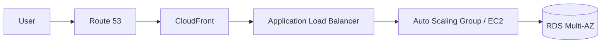

# awsguru — Project Blueprint

A complete, copy-into-a-new-directory spec for building an **AWS Solutions
Architect Associate (SAA-C03)** study site + RAG chat tutor — the same shape and
feature set as the `finguru` technical-analysis project, retargeted to AWS.

> **How to use this file.** Create an empty directory (e.g. `~/workspace/awsguru`),
> copy this file in as `BLUEPRINT.md`, open Claude Code there, and say:
> *"Read BLUEPRINT.md and build this project. Start with Phase 0, then get the
> pilot approved before the bulk content workflow."*
> Everything Claude needs — stack, decisions, content plan, gotchas — is below.

---

## 1. What we're building

A thorough, beginner→exam-ready study guide to **architecting on AWS**, taught
through the **services** and the **architectural patterns / Well-Architected
pillars** that the SAA-C03 exam tests — paired with a **RAG-grounded chat tutor**
that answers from the very same lessons.

Three pillars, identical in spirit to finguru:

1. **Deep-researched study materials** — fact-checked lessons, each one a real
   teaching article (not bullet dumps), sequenced beginner → pro.
2. **Bilingual EN + KO** — every lesson and the tutor itself work in English and
   Korean. English is the default/source; Korean lives in a parallel tree with
   English fallback.
3. **Graphical materials = architecture diagrams** — instead of finguru's
   Chart.js price charts, lessons embed **Mermaid diagrams** (architecture/flow/
   sequence). Text-based, so the content pipeline can author them and the build
   stays deterministic.
4. **Ask-the-tutor** — a streaming chat widget, page-aware, grounded in the
   lessons via RAG, with a web-search fallback and follow-up suggestion chips.

The defining principle (keep it): **content is the single source of truth.** The
MDX files humans read are the same files the RAG pipeline ingests, so the tutor
never drifts from the guide.

---

## 2. Architecture & stack (carry over verbatim from finguru)

```
awsguru/
├── docker-compose.yml      # web + api, one command up
├── .env                    # secrets + model config (gitignored)
├── .env.example            # template
├── README.md
├── run.sh                  # local dev launcher
│
├── web/                    # Next.js (App Router) + MDX + Tailwind v4
│   ├── app/[locale]/       # home, /path, /services/[slug], /concepts/[slug]
│   ├── components/
│   │   ├── ChatWidget.tsx          # SSE streaming tutor
│   │   ├── LessonLayout.tsx        # TOC + prev/next
│   │   ├── Mdx.tsx                 # MDX renderer + component registry
│   │   ├── Callout.tsx
│   │   ├── LocaleSwitcher.tsx
│   │   └── diagrams/               # <-- replaces charts/
│   │       ├── Diagram.tsx         # Mermaid wrapper (flow/sequence/arch)
│   │       ├── ArchDiagram.tsx     # AWS-icon architecture diagram (optional sugar)
│   │       └── DiagramFrame.tsx    # caption + frame, mirrors ChartFrame
│   ├── lib/
│   │   ├── content.ts              # MDX loader (source of truth for site + RAG)
│   │   └── i18n.ts                 # locales + UI strings
│   └── content/
│       ├── services/*.mdx          # EN service deep-dives
│       ├── concepts/*.mdx          # EN patterns / Well-Architected / domains
│       └── ko/                     # Korean tree, same filenames
│           ├── services/*.mdx
│           └── concepts/*.mdx
│
└── api/                    # FastAPI + LangGraph
    ├── app/main.py                 # /health, /chat (SSE)
    ├── app/ollama_client.py        # Ollama Cloud chat (native + streaming)
    ├── app/routes/chat.py          # streaming tutor endpoint
    ├── app/agent/
    │   ├── graph.py                # retrieve → web-fallback → assemble → stream
    │   └── websearch.py            # Tavily, else DuckDuckGo
    └── app/rag/                    # ingest + retriever over Chroma
        ├── chunk.py                # MDX → chunks (strips JSX/diagram blocks)
        ├── embeddings.py           # local fastembed, multilingual e5-large
        ├── store.py                # Chroma collection
        ├── retriever.py            # locale-filtered top-k
        └── ingest.py               # rebuild index from MDX
```

**Frontend:** Next.js 15 (App Router) + React 19 + MDX (`next-mdx-remote-client`)
+ Tailwind v4 + `@tailwindcss/typography`. `gray-matter` for frontmatter,
`remark-gfm` + `rehype-slug` for MDX.

**Backend:** Python 3.11+, FastAPI + uvicorn, LangGraph, ChromaDB (file-backed),
`fastembed` for local embeddings, managed with `uv`.

**Models:**
- Chat: **Ollama Cloud**, default `qwen3.5:cloud`, swappable via `OLLAMA_CHAT_MODEL`.
- Embeddings: **local** `intfloat/multilingual-e5-large` (1024-dim) via fastembed,
  because the Ollama Cloud tier does not expose `/api/embed`. Kept env-swappable
  (`EMBEDDING_BACKEND=local|ollama`).

**Deploy:** local dev first via `docker-compose`. Web on host port **48080**,
API on **48000** (unusual host ports, standard inside containers — mirrors finguru).

---

## 3. The one real change vs finguru: diagrams instead of charts

finguru rendered illustrative price charts via custom React components
(`<LineChart>`, `<CandleChart>`) wrapping Chart.js, registered in `Mdx.tsx`.

For AWS we need **architecture diagrams**. Use **Mermaid** (text-based, renders
client-side, no external service) as the primary engine.

- `web/components/diagrams/Diagram.tsx` — a `"use client"` component that renders a
  Mermaid definition passed as a string/children. Support these diagram types via
  one component: `flowchart`, `sequenceDiagram`, and Mermaid's `architecture-beta`
  (which has cloud/AWS-style icons via iconify packs). Lazy-load `mermaid` and call
  `mermaid.run()` in an effect; render into a `<DiagramFrame>` with a caption.
- `web/components/diagrams/ArchDiagram.tsx` — optional thin sugar over `Diagram`
  that defaults to `architecture-beta` and wires AWS icon packs, so lesson authors
  can write high-level "VPC → ALB → ASG of EC2 → RDS Multi-AZ" topologies cleanly.
- Register both in `Mdx.tsx`'s component map next to `Callout`.

Authoring in MDX looks like:

````mdx
<Diagram caption="Request flow through a public-facing 3-tier app">



</Diagram>
````

**Why Mermaid (not a drawing lib):** it's plain text, so the deep-research content
workflow can generate diagrams the same way finguru's workflow generated chart
props; it diffs cleanly in git; and it survives RAG ingestion (the chunker strips
the fenced block from the embedded text so diagram syntax never pollutes the index
— see §6 gotchas).

> Alternative if Mermaid's AWS icons feel too generic: hand-authored inline SVG
> React components per topology. More control, far more work. Start with Mermaid;
> only escalate if the user asks for production-grade AWS iconography.

---

## 4. Curriculum (SAA-C03)

Two `kind`s mirror finguru's `guru` / `indicator` split:

- **`service`** — deep dive on one AWS service: what it is, when to choose it,
  key knobs, limits, pricing model, and the exam traps.
- **`concept`** — architectural patterns, the Well-Architected pillars, and the
  four exam domains: how the services compose into resilient / secure /
  performant / cost-optimized designs.

Sequence beginner → pro via the `order` field (drives `/path`). Suggested set
(~30 lessons; adjust with the user during the pilot):

**Services (order 1–20ish):**
IAM · VPC (subnets, route tables, IGW/NAT, peering, endpoints) · EC2 &
instance types · EBS & instance store · Elastic Load Balancing (ALB/NLB/GLB) ·
Auto Scaling · S3 (storage classes, lifecycle, versioning) · S3 security
(policies, encryption, Block Public Access) · CloudFront · Route 53 (routing
policies) · RDS & Aurora · DynamoDB · ElastiCache · Lambda · API Gateway · SQS ·
SNS · ECS / Fargate / EKS · CloudWatch & CloudTrail · KMS & Secrets Manager.

**Concepts / patterns (order 100+):**
Well-Architected Framework (5/6 pillars) · Designing for High Availability &
Multi-AZ · Disaster Recovery strategies (Backup&Restore → Pilot Light → Warm
Standby → Multi-Site) · Decoupling with queues & events · Serverless patterns ·
Caching strategies · Security: defense-in-depth, least privilege, encryption
at-rest/in-transit · Cost optimization (right-sizing, Savings Plans/RIs, Spot) ·
Choosing the right database · Choosing the right compute · Migration & hybrid
(Direct Connect, VPN, Storage Gateway, Snow family).

**Frontmatter schema** (in `web/lib/content.ts`):

```ts
interface LessonFrontmatter {
  title: string;
  slug: string;
  kind: "service" | "concept";
  level: "beginner" | "intermediate" | "advanced";
  order: number;            // position in the learning path
  summary: string;
  tags?: string[];
  prereqs?: string[];       // slugs of recommended prior lessons
  // service-specific (optional):
  category?: string;        // "Compute" | "Storage" | "Networking" | "Database" | "Security" | ...
  examDomains?: string[];   // ["Resilient","Secure","Performant","Cost-Optimized"]
}
```

Every lesson should: open with a one-sentence version, teach the concept in prose,
embed **at least one Mermaid diagram**, use `<Callout type="key|note|warning">`
for highlights, and end with **exam-relevant gotchas** (the SAA loves "which
service for X" and "cheapest/most-resilient option" distinctions).

---

## 5. Build plan (phased — mirrors finguru, de-risk before bulk)

- **Phase 0 — scaffold + infra.** Web + API + docker-compose + `.env.example` +
  `run.sh`. Health check green, blank home page renders, chat widget stub.
- **Phase 1a — PILOT (get user approval here).** Build **one service lesson
  (e.g. S3) + one concept lesson (e.g. Disaster Recovery strategies)**, both with
  Mermaid diagrams, plus the `<Diagram>`/`<ArchDiagram>` components and lesson
  page layout. Show the user before scaling.
- **Phase 1b — bulk content.** Once the pilot is approved, run a **parallel
  content-production workflow** (one agent per remaining lesson) to deep-research
  and write the rest. Diagrams can be a second fan-out pass like finguru did.
- **Phase 2 — RAG ingestion.** `chunk → embed (local e5-large) → Chroma`.
  Re-run `cd api && uv run python -m app.rag.ingest` after any content change.
- **Phase 3 — LangGraph tutor.** Grounded streaming answers with lesson citations,
  web-search fallback, page-awareness, follow-up chips, and a guardrail (teach
  concepts; no real-account cost/billing advice or "just do X in prod" calls —
  steer to Well-Architected tradeoffs).
- **Phase 4 — frontend polish.** Lesson pages with TOC + prev/next, learning path
  (`/path`), service/concept indexes, locale switcher, streaming chat with
  citation chips.
- **Phase 5 — Korean.** Translate all lessons into `web/content/ko/`, switch
  retrieval to locale-filtered, tutor answers in the reader's language.

The user **opts into parallel workflows** for bulk content/diagram production —
offer it, don't assume it for small steps.

---

## 6. Critical gotchas (learned on finguru — carry these forward)

- **MDX bare `<`:** a `<` immediately before a digit/operator in prose is parsed
  as JSX and breaks the build. Write comparisons as inline code (`` `<20ms` ``,
  `` `t3.micro < t3.small` ``) or escape to `&lt;`. Very common in AWS prose
  (latency `<10ms`, `<100 RPS`, etc.) — watch for it.
- **Diagram blocks must not pollute RAG.** In `api/app/rag/chunk.py`, strip fenced
  ```` ```mermaid ```` blocks and JSX component tags (`<Diagram>`, `<ArchDiagram>`,
  `<Callout>` open/close) from the text before chunking, so Mermaid syntax and
  component noise never get embedded. (finguru stripped chart-component props the
  same way.)
- **Embeddings:** Ollama Cloud `/api/embed` returns 401 on this tier even though
  chat works — **use local fastembed**. The Ollama API key has a `.` in it and the
  FULL string after the dot is required (truncating → 401). `/api/tags` is public;
  don't use it to validate a key.
- **Thinking blocks:** `qwen3.5:cloud` is a reasoning model and emits a long
  `message.thinking` field first, stalling streaming 15s+. Send `"think": false`
  in the `/api/chat` payload (env `OLLAMA_THINK=false`, the default).
- **Streaming:** stream `/api/chat` token-by-token via a Next.js **route handler**
  (not a naive rewrite) so SSE flushes incrementally to the browser.
- **e5-large needs prefixes:** prepend `query:` to questions and `passage:` to
  documents in `embeddings.py`. Tune the grounding threshold (`_MIN_SCORE` ≈ 0.82)
  — real matches land ~0.83–0.90, off-topic ~0.81; below it, web-fallback.
- **Ingest is slow & must be serialized:** ~minutes on CPU for the full corpus,
  one-time. **Never run two `app.rag.ingest` at once** — they thrash CPU and race
  the Chroma store. Kill stragglers first. `reset_collection()` handles embedding
  dim changes (rebuilds from scratch each run).
- **Translation workflow** occasionally leaks harness tags (e.g. `</...>`) at file
  end — strip before saving Korean MDX.
- **Tutor persona:** short, conversational, **plain text + sparse emoji, NO
  markdown**, no self-intro, ends by inviting a follow-up. Korean answers should
  gloss technical terms with English in parens, e.g. 가용 영역(AZ).

---

## 7. Env template (`.env.example`)

```bash
# ---- Ollama Cloud (chat / inference) ----
OLLAMA_BASE_URL=https://ollama.com
OLLAMA_API_KEY=replace-with-your-full-key-including-the-part-after-the-dot
OLLAMA_CHAT_MODEL=qwen3.5:cloud
OLLAMA_THINK=false

# ---- Web search fallback (when RAG finds nothing) ----
TAVILY_API_KEY=                     # optional; falls back to DuckDuckGo if empty

# ---- Embeddings (local, swappable) ----
EMBEDDING_BACKEND=local             # "local" (fastembed) or "ollama"
LOCAL_EMBEDDING_MODEL=intfloat/multilingual-e5-large
OLLAMA_EMBEDDING_MODEL=embeddinggemma

# ---- RAG / Chroma ----
CHROMA_DIR=./chroma_db
CHROMA_COLLECTION=awsguru_lessons
RAG_TOP_K=5

# ---- Content / i18n ----
CONTENT_DIR=../web/content
LOCALES=en,ko

# ---- Server ----
API_HOST=0.0.0.0
API_PORT=48000
CORS_ORIGINS=http://localhost:48080
```

The real `.env` (with the Ollama key) is **gitignored**. The finguru key was
pasted in chat once — recommend the user rotates it and never commits it.

---

## 8. Run it

**Docker:**
```bash
cp .env.example .env          # paste your real OLLAMA_API_KEY
docker compose up --build
# web → http://localhost:48080   api → http://localhost:48000/health
```

**Local (no Docker):**
```bash
# Terminal 1 — API
cd api && uv sync && uv run uvicorn app.main:app --reload --port 48000
# Terminal 2 — Web
cd web && npm install && npm run dev
```
The web dev server proxies `/api/*` to the API (`next.config.mjs` rewrite +
streaming route handler), so the browser talks to a single origin.

**After any content edit**, refresh the tutor's knowledge:
```bash
cd api && uv run python -m app.rag.ingest
```

---

## 9. Adding or editing a lesson

1. Drop an `.mdx` file in `web/content/services/` or `web/content/concepts/`,
   copying frontmatter from an existing lesson.
2. Highlight boxes only via `<Callout type="key|note|warning">…</Callout>`.
3. Diagrams via `<Diagram caption="…">` with a fenced `mermaid` block (or
   `<ArchDiagram>` for AWS-icon topologies).
4. Escape bare `<` before digits/operators (inline code or `&lt;`).
5. The page appears automatically; re-run ingest to make the tutor aware of it.
6. For a new locale, translate into `web/content/<locale>/…` (same filenames) and
   add it to `LOCALES`; missing files fall back to English on the site and stay
   locale-accurate in retrieval.

---

### Naming note
This blueprint uses `awsguru` / collection `awsguru_lessons` / kinds
`service` & `concept`. Rename freely (e.g. `saaguru`, `cloudguru`) — just keep it
consistent across `docker-compose.yml`, `.env`, `content.ts`, and routes.
